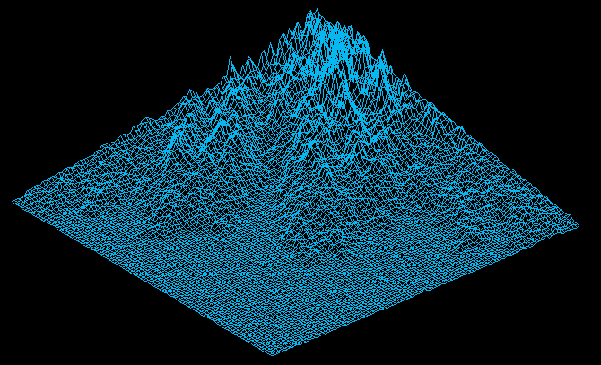

<h1>FdF</h1>

<h2>What is it ? </h2>

A program that represents a wireframe model, meaning that a landscape as a 3D object in which all surfaces are outlined in lines. You can read the subject [here](00_Projects/03_Graphic/fdf.pdf).

* **Graphical library** : *Minilibx* (from 42 school)
* **Language** : *C*

It takes a .txt file as an input. The file has to respect the following format :

Numbers represent the height of the "hills" and can be negative. 
The number of columns and the number of lines can be different.

<h2>Usage</h2>

To run the program :
* make
* ./fdf name_of_map.txt

Pressing Z button increases the heights.

Pressing -> and <- arrows makes the map rotate.

<h2>Preview</h2>

 

