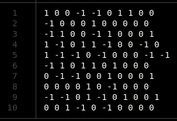
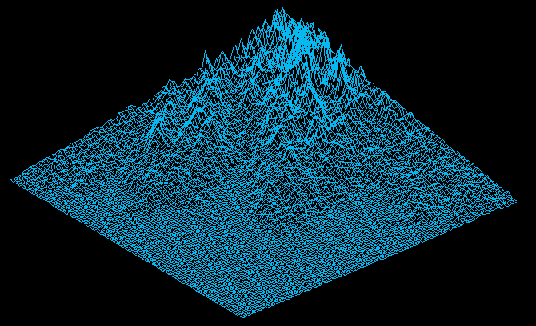

<h1>FdF</h1>

<h2>What is it ? </h2>

A program that represents a wireframe model, meaning that a landscape as a 3D object in which all surfaces are outlined in lines. You can read the subject [here](00_Projects/03_Graphic/fdf.pdf).

* **Graphical library** : *Minilibx* (from 42 school)
* **Language** : *C*

It takes a .txt file as an input. The file contains rows of numbers :  

Numbers represent the height of the "hills" and can be negative. 
The number of columns and the number of rows can be different, but rows must have the same size, as well as the columns.

<h2>Usage</h2>

To run the program :
* make
* ./fdf name_of_map.txt

<h2>Features</h2>
Press Z button to increase the heights.
Press -> and <- arrows to make the map rotate.
Scroll with your mouse to zoom in and out.

<h2>Preview</h2>

